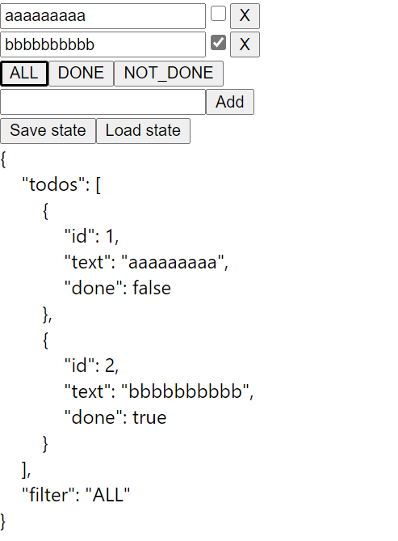

# Proof of concept for a tree of POJO state that is all Proxies under the hood and observable by React

To try out, make sure you use `observable-proxy-proof-of-concept` branch and run:

```
npm install
npm start
```

This showcases how we can have a tree of state that looks like Plain Old JS Objects to the outside world, but is actually made of proxies and thus fully observable. 

In short, your state definition comes down to:

```Typescript
type Todo = {
    id: number,
    text: string,
    done: boolean
};

type Filter = "ALL" | "DONE" | "NOT_DONE";

type State = {
    todos: Todo[]
    filter: Filter
}

export const app = makeApp({} as State);

app.state.todos = []; //despite being added later, these are fully observable
app.state.filter = "ALL";
```

Yet, any changes to state tree are fully observable and React components will re-render when needed (smartly too, just the ones relying on the state that changed).

```Typescript
export const TodoCmp = React.memo(observer2(({ todo }: {
    todo: Todo
}) => {
    return <>
        <input
            type="text"
            onChange={({ target: { value } }) => todo.text = value} //notice, we just set todo.text
            value={todo.text}
        />
        <input
            type="checkbox"
            onChange={({ target: { checked } }) => todo.done = checked}
            checked={todo.done}
        />
    </>
}));

export const TodoAdderCmp = React.memo(observer2(({ todoList }: {
    todoList: Todo[]
}) => {

    const [text, setText] = useState("");

    return <div>
        <input
            type="text"
            onChange={({ target: { value } }) => setText(value)}
            value={text}
        />
        <button onClick={() => {
            const id = Math.max(0, ...todoList.map(x => x.id)) + 1;
            //if you have the list - you can push to it
            todoList.push({
                id,
                text,
                done: false
            });
            setText("");
        }}>
            Add
        </button>
    </div>
}));
```

As a result, you can save and load application state by simple converting it to/from JSON.

```Typescript

export const StateSaveLoadCmp = React.memo(observer2(({ appState }: { appState: State }) => {

    const [savedState, setSavedState] = useState("");

    return <div>
        <button
            onClick={() => {
                const json = JSON.stringify(appState, undefined, 4).replace(/ /g, "\u00A0")
                setSavedState(json);
            }}
        >Save state</button>
        <button
            onClick={() => {
                const state = JSON.parse(savedState);
                Object.assign(appState, state);
            }}
        >Load state</button>
        <div style={{ whiteSpace: "pre" }}>
            {savedState}
        </div>
    </div>;
}));
```

